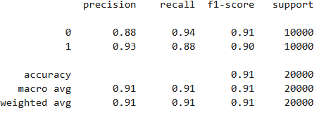
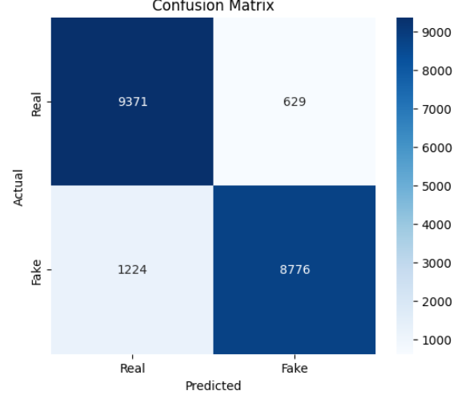

## Overview

The goal of this project is to investigate whether deep learning models can accurately distinguish between authentic images and images generated by Artificial Intelligence. As generative models such as Stable Diffusion, DALLE and Midjourney continue to improve, identifying synthetic media has become increasingly difficult for humans. This can be visible throughout social media platforms such as Facebook and Instagram. Automated detection methods may therefore play an important role in verifying the authenticity of such media.

The original goal of our project was to develop an AI content detector capable of identifying whether a video was AI-generated or real. As the project evolved, we refined the scope by dividing the work into two  directions: AI-generated video detection and AI-generated image detection. For Milestone 1, this notebook focuses on the image-detection branch of the project and presents a complete PyTorch training pipeline for classifying images as either real or AI-generated.

## Contributions
- Bilal Hasanov worked on AI image detection pipeline.
- Muaataz Abdulhakeem Ismaeel worked on AI video detection pipeline.

## Technicalities

The project implements a full training pipeline using PyTorch and transfer learning. The model architecture that is used is EfficientNet-B0, which is a convolutional neural network that was originally trained on the ImageNet dataset (which contains 1.3 million images and 1000 classes of various objects such as cars, airplanes, trees, and so on). This pretrained EfficientNet backbone is loaded using ImageNet weights, and the original classification head that contains 1000 classes is replaced with a new fully connected layer for binary classification (real vs AI-generated). 

During the first phase of training, the pretrained backbone is frozen and only the classifier layer is trained. After three out of the twenty epochs, the seventh and final convolutional block is unfrozen and fine-tuned so the model can adapt its learned features to AI image detection task.

## Dataset
This project uses the CIFAKE dataset, which is a dataset containing both real images and AI-generated images using Stable Diffusion v4. The dataset contains a total of 120,000 samples, 60,000 of which are real images and the rest 60,000 are AI generated. Images are resized to 224×224 pixels to match the input requirements of EfficientNet.

Dataset can be found at: 
https://www.kaggle.com/datasets/birdy654/cifake-real-and-ai-generated-synthetic-images

## Running Requirements

- Python 3 is required.
- The program was written in Google Colab and will best ran on that platform.
- There are also separate python modules located in python_modules folder.
- All required libraries are available in the standard Google Colab environment. Running `!pip install kagglehub` may be needed in some versions.
- If running locally, install the dependencies listed in `requirements.txt` by running `pip install -r requirements.txt`

## Results

After training, the model achieved approximately 90% accuracy on the training dataset. This indicates that the model successfully learned features that help distinguish between real images and AI-generated images.

The use of transfer learning with EfficientNet-B0 allowed the model to quickly adapt to the binary classification task. Training only the classifier layer during the early epochs helped stabilize learning, though later fine-tuning of the final convolutional layers allowed the network to adjust deeper features to the AI-image detection task.

Although the results demonstrate that the approach is technically viable, further improvements are possible. One potential improvement is to fine-tune additional layers of the pretrained backbone, which may allow the model to learn more task-specific visual patterns. Additionally, experimenting with different architectures (such as MobileNet, ResNet50, and so on), tuning hyperparameters, or even more robust data augmentation strategies could further improve this performance.

Overall, this experiment confirms that a pretrained convolutional neural network can learn meaningful patterns for distinguishing AI-generated images from real ones, hence making the proposed approach a viable starting point for synthetic media detection.
